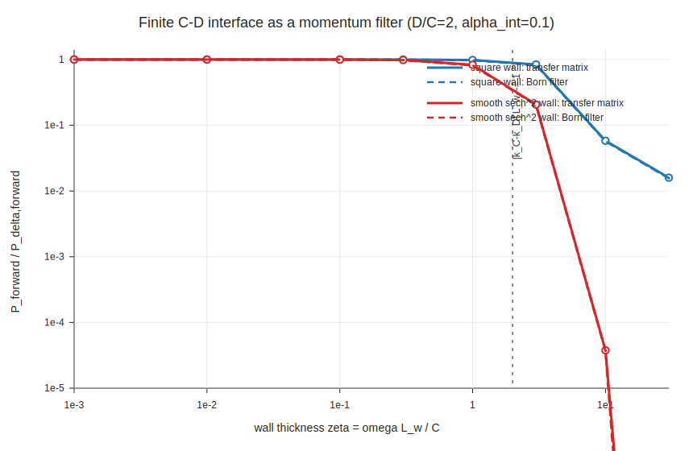

# A C-D Observability Hierarchy for Multi-Sector Speed Constants

Draft date: 2026-06-30

## Abstract

We study a two-sector thought experiment in which a hidden sector is assigned an internal speed scale \(D\) while the visible sector uses speed scale \(C\). The central question is not whether two numerical constants can be written down, but whether their ratio \(D/C\) has invariant observable content for a visible observer. We show that under exact local Lorentz equivariance, smooth local sector maps, and flat relative sector calibration, it does not. A constant Lorentz-compatible linear map is only a scale map. A smooth Lorentz-equivariant point map sends every Lorentz orbit into itself and maps null rays to null rays. A flat relative calibration connection is pure gauge on a simply connected region, so it has no closed-path observable. Observable C-D physics therefore requires a controlled failure of at least one assumption: preferred hidden fields, relative curvature or holonomy, defects or interfaces, or portal-projected effective coefficients. We propose a visible-relativity protection principle that keeps Standard-Model Lorentz violation below existing bounds while allowing hidden or relative-sector calibration failure. As a worked escape example, we analyze a one-dimensional C-D interface and show that finite wall thickness acts as a momentum filter: forward conversion is controlled by the wall Fourier component at \(k_C-k_D\). The result is not evidence for a hidden D world, but a no-go and classification framework for when a hidden speed scale can become physical.

## 1. Introduction

The phrase "a second light speed" is ambiguous. If two decoupled sectors each define their own clocks and rods, a numerical difference between their internal light speeds can be removed by calibration. If the sectors interact, however, a visible observer may ask whether hidden null propagation can appear as a distinct causal cone, a delayed or advanced echo, a closed-loop phase, or a portal-induced effective-field-theory coefficient.

This paper formulates that question as an observability problem. We call the visible sector \(C\) and the hidden sector \(D\). The symbols \(C\) and \(D\) do not by themselves denote two visible signal speeds. They denote sectoral calibration data whose physical status depends on the inter-sector map, the existence of portals, and the global structure of the relative calibration.

The main result is negative but useful: exact local relativity erases a local C-D speed ratio. A hidden speed constant becomes visible only when at least one of the assumptions behind this erasure fails. This viewpoint protects the construction from a common mistake: promoting a coordinate or unit convention into new physics.

The work is deliberately narrower than a general Lorentz-violation or bimetric-gravity program. The idea that different sectors may carry different limiting speeds is not new; it appears in Lorentz-violating field-theory and superluminal-particle discussions [@Redigolo2012LorentzViolatingSUSY; @ChashchinaSilagadze2012LightSpeedBarrier]. Local visible-sector Lorentz violation is already systematically parameterized and tightly constrained by the Standard-Model Extension (SME) [@ColladayKostelecky1998SME; @KosteleckyRussell2011DataTablesSME]. Disformal metrics and preferred timelike fields have a long history [@Bekenstein1993DisformalGeometry; @Jacobson2008EinsteinAetherStatus]. Photon velocity oscillations and active-sterile altered-dispersion models already cover important portal phenomenology [@Glashow1998PhotonVelocityOscillations; @DeAngelisPain2002PhotonVelocityOscillations; @KosteleckyMewes2004Neutrinos; @PaesPakvasaWeiler2005ShortcutSterile; @HollenbergPaes2009ADRResonance; @Barenboim2019SterileADRRevisited]. Our goal is not to rename these fields. Our goal is to state what the C-D hypothesis adds before it enters them.

The contribution is an observability hierarchy. First, constant local maps fail to produce a second cone. Second, smooth nonlinear point maps still fail if they remain Lorentz equivariant and lack background tensors. Third, flat relative calibration connections are pure gauge. Fourth, the remaining escape classes can be organized by which assumption they break and which known constraints they must pass.

### Contribution and Scope

| This paper claims | This paper does not claim |
|---|---|
| \(D/C\) is locally unobservable under exact common Lorentz equivariance, smooth sector maps, and flat relative calibration | Multiple limiting speeds are new |
| C-D observability requires a named failure mode: background field, holonomy, defect/interface, or portal projection | A visible observer can directly measure a large second photon speed |
| The escape classes are constrained by known SME, disformal, aether, clock, portal, and multimetric literatures | Disformal metrics, SME coefficients, Weyl effects, hidden photons, or multimetric gravity are new by themselves |
| A finite interface gives a calculable coherence filter for one controlled escape route | The toy interface is already a realistic cosmological or laboratory detection proposal |

Throughout the paper, "breaking relativity" means particle or background Lorentz breaking in a sector, not a failure of observer covariance. Equations may still be written covariantly even when a background field such as \(u^\mu\) selects a physical frame.

This distinction is essential. A theory that abandons observer covariance has lost the common language in which different laboratories compare measurements. The C-D route considered here instead relaxes narrower assumptions: exact hidden-sector Lorentz symmetry, smooth global inter-sector calibration, flat relative connection, or exact decoupling from portal-induced effective coefficients.

| Result | Assumptions | Conclusion | Escape |
|---|---|---|---|
| Theorem 1 | constant linear Lorentz-compatible map | only \(A=\kappa I\) | nonlinear, nonlocal, internal, defect |
| Theorem 2 | smooth Lorentz-equivariant point map \(F:V\to V\) | \(F^\mu=\alpha_b(x^2)x^\mu\), null rays preserved | preferred tensors, topology, discontinuity, path dependence |
| Theorem 3 | flat relative calibration on simply connected region | pure gauge, no holonomy | curvature, topology, defect/interface |

## 2. C-D Observability

Let \(V\simeq\mathbb{R}^{1,3}\) be a local natural-coordinate vector space with Lorentz metric \(\eta_{\mu\nu}\). A C-sector observer uses the visible metric \(g_{\mu\nu}\), locally equivalent to \(\eta_{\mu\nu}\). A D-sector field may use its own internal calibration or effective metric. We ask when that difference becomes visible as more than a field label.

We define C-D observability as at least one of the following:

1. A D-sector null ray is mapped into a C-sector non-null ray by an invariant inter-sector map.
2. A C-sector observer can measure a second causal cone not removable by units, clocks, or field redefinitions.
3. A closed path or defect produces a gauge-invariant relative calibration holonomy.
4. A portal projects hidden-sector geometry into visible EFT coefficients with a constrained origin.

This definition intentionally excludes weak statements such as "there exists a hidden massive particle." Hidden particles can be observable without making \(D/C\) an observable spacetime property.

## 3. Local No-Go Hierarchy

The local no-go results use a shared set of hypotheses. The calculation is performed in one local tangent vector space \(V\), the visible and hidden calibration data are compared through the same proper orthochronous Lorentz action, and the inter-sector map acts on the ordinary vector representation without extra background tensors, defects, path dependence, or enlarged internal spaces. These hypotheses are deliberately strong. They identify when \(D/C\) is only calibration data; the escape classes in Section 5 are exactly the ways to relax them.

### 3.1 Theorem 1: Linear Scale-Map No-Go

Let \(A:V\to V\) be a constant real linear inter-sector map. Exact relativity of the local calibration requires

\[
A\Lambda=\Lambda A,\qquad \forall \Lambda\in SO^+(1,3).
\]

Write \(A\) in time-space block form:

\[
A=
\begin{pmatrix}
a&r^T\\
s&B
\end{pmatrix}.
\]

Commutation with all spatial rotations forces \(r=s=0\) and \(B=bI_3\). Commutation with any nonzero boost then forces \(a=b\). Therefore

\[
A=\kappa I .
\]

Thus a Lorentz-compatible constant map preserves the null cone:

\[
x^2=0 \quad\Rightarrow\quad (Ax)^2=\kappa^2x^2=0 .
\]

The ratio \(D/C\), if represented only by such a constant local calibration, cannot become a visible second light cone.

### 3.2 Theorem 2: Nonlinear Point-Map No-Go

One might try to evade the previous result with a nonlinear map. Let \(F:V\to V\) be a smooth finite point map on each Lorentz orbit and assume exact Lorentz equivariance:

\[
F(\Lambda x)=\Lambda F(x),\qquad \forall \Lambda\in SO^+(1,3).
\]

For any nonzero \(x\), the little group \(G_x\) fixes \(x\). Equivariance gives

\[
F(x)=F(hx)=hF(x),\qquad h\in G_x.
\]

Therefore \(F(x)\) must lie in the fixed subspace of the little group. For timelike, spacelike, and null orbits, this fixed subspace is the line spanned by \(x\). The scalar multiplier can depend only on Lorentz invariants and branch labels. Hence

\[
F^\mu(x)=\alpha_b(x^2)x^\mu .
\]

In particular, null rays are mapped into the same null rays or to zero:

\[
x^2=0\quad\Rightarrow\quad F(x)^2=0 .
\]

Nonlinearity alone therefore does not rescue C-D observability. The theorem does not apply to nonlocal maps, momentum-space deformations, defects, discontinuities, preferred tensors, or maps into enlarged internal spaces. Those are precisely escape classes.

For analytic \(F\), the Taylor expansion makes the same point. Lorentz equivariance requires the first coefficients to be intertwiners:

\[
F^\mu(x)=A^\mu{}_\nu x^\nu
+B^\mu{}_{\nu\rho}x^\nu x^\rho
+C^\mu{}_{\nu\rho\sigma}x^\nu x^\rho x^\sigma+\cdots .
\]

The symbolic check in `scripts/cd_no_go_symbolic_checks.py` finds

\[
\dim\operatorname{Hom}_{SO(1,3)}(V,V)=1,\qquad
\dim\operatorname{Hom}_{SO(1,3)}(\mathrm{Sym}^2V,V)=0,
\]

and the cubic correction is proportional to \(x^2x^\mu\). Again it cannot change the null cone.

### 3.3 Theorem 3: Flat Relative-Connection No-Go

The previous results concern point maps. A more global formulation treats C-D calibration as a relative connection. In the simplest Abelian clock-scale case,

\[
d\tau_D=\kappa(d\tau_C+qB_\mu dx^\mu),
\]

with gauge transformation

\[
B\to B+d\varphi .
\]

The closed-path observable is

\[
H[\gamma]=\exp\left(q\oint_\gamma B\right).
\]

If \(U\) is simply connected and

\[
F=dB=0,
\]

then by the Poincare lemma \(B=d\varphi\) on \(U\), and \(B\) can be gauged away. Every contractible closed-loop holonomy is trivial.

For a non-Abelian relative connection,

\[
{\cal F}=d{\cal A}+{\cal A}\wedge{\cal A}.
\]

If \({\cal A}=M^{-1}dM\) for a smooth global sector map, the Maurer-Cartan identity gives \({\cal F}=0\). A smooth pure calibration does not create relative curvature.

The first macroscopic C-D invariant is therefore the conjugacy class of

\[
P\exp\oint_\gamma {\cal A},
\]

or, for small contractible loops, the relative curvature integrated over the spanning surface.

## 4. Visible Relativity Protection Principle

The C-D program should not assume large visible-sector relativity violation. The empirical posture should be:

\[
\begin{aligned}
\text{protect visible relativity}
&\quad+\quad
\text{allow hidden or relative-sector calibration failure}
\\
&\quad+\quad
\text{make observability portal-suppressed or topological/interface-limited}.
\end{aligned}
\]

In practice the Standard Model should see

\[
{\cal L}_{SM}={\cal L}_{SM}[g,\psi,A,\ldots]+\delta{\cal L}_{SME},
\]

where \(\delta{\cal L}_{SME}\) remains below existing constraints. A hidden sector may instead see, for example,

\[
f_{\mu\nu}=\Omega^2(g_{\mu\nu}-\xi u_\mu u_\nu),
\]

but this does not automatically create a visible second cone. The background \(u^\mu\) is a controlled escape hatch, not a free lunch; it places the model near disformal, SME, and Einstein-aether boundaries [@Bekenstein1993DisformalGeometry; @Jacobson2008EinsteinAetherStatus].

Relativity is therefore not treated as a binary switch. The useful question is which layer is preserved and which layer is relaxed:

| Layer | Status in this paper | Consequence |
|---|---|---|
| Observer covariance | Preserved | Equations remain tensorial and laboratories can compare invariant claims |
| Visible Standard-Model Lorentz symmetry | Protected | Any leakage is an SME-like coefficient below existing bounds |
| Hidden-sector metric Lorentz structure relative to \(g_{\mu\nu}\) | May differ from the visible one | A hidden cone, preferred field, or dispersion relation can exist but is not visible by itself |
| Inter-sector calibration | May be curved, discontinuous, or path dependent | C-D observables can appear as holonomy, conversion, echo, or transient structure |
| Portal decoupling | May be weakly broken | Hidden geometry can project into constrained visible EFT textures |

Here "hidden-sector Lorentz symmetry may be relaxed" means relaxed relative to the visible metric \(g_{\mu\nu}\). A D field may still have an exact local Lorentz structure with respect to its own effective metric \(f_{\mu\nu}\). What cannot remain exact, if \(f_{\mu\nu}\) is not conformal to \(g_{\mu\nu}\) and the two sectors interact, is a single common Lorentz group that simultaneously erases the C-D speed ratio.

This gives a useful constraint on any attempted small relativity-principle relaxation. Define the common local symmetry of two cones by

\[
G_{\rm common}=O(g)\cap O(f).
\]

If the full visible Lorentz group \(O(g)\) also preserves \(f\), then \(f\) is a Lorentz-invariant symmetric bilinear form. In a local frame with \(g=\eta\), invariance under spatial rotations makes \(f=\operatorname{diag}(a,b,b,b)\), and invariance under one nonzero boost forces \(a=-b\). Therefore

\[
f_{\mu\nu}=\Omega^2 g_{\mu\nu}.
\]

A full common Lorentz principle thus permits only a conformal second metric, which has the same null cone. A genuine \(D/C\neq1\) cone can still be logically consistent, but it must be paid for by one of three moves: independent sector Lorentz groups with no local comparison, a proper-subgroup common symmetry selected by a background field, or a nonlocal/global calibration failure such as holonomy or an interface. This is the sense in which the relativity principle is constrained rather than discarded.

The preferred-field representative makes the point explicit. In the local rest frame of \(u^\mu\), with \(C=1\) and signature \((-+++)\),

\[
f_{\mu\nu}=\Omega^2(g_{\mu\nu}-\xi u_\mu u_\nu)
\]

gives

\[
0=f_{\mu\nu}dx^\mu dx^\nu
=\Omega^2[-(1+\xi)dt^2+d\mathbf{x}^2],
\qquad
v_D=\sqrt{1+\xi}.
\]

Thus \(D/C=\sqrt{1+\xi}\) is a hidden-metric statement, not yet a visible observable. It becomes visible only through a portal or a nontrivial relative calibration; any local leakage into Standard-Model fields must then appear as constrained Lorentz-violating effective coefficients, schematically of order portal strength times \(\xi u^\mu u^\nu\).

This gives a sharp constraint: exact local relativity plus smooth flat calibration makes \(D/C\) unobservable, while observable C-D physics must identify its controlled relaxation. A proposed signal that cannot name this relaxation is probably a choice of units or a renamed Lorentz-violation model.

The practical checklist is:

1. Which layer of relativity is preserved, and which no-go assumption is broken?
2. Does the visible Standard Model sector remain protected?
3. Which SME, aether, clock, domain-wall, or gravity bound applies?
4. Is the proposed observable invariant, or only a calibration artifact?
5. Is the portal technically natural or symmetry protected?

## 5. Escape Classes

| Escape class | Broken assumption | Typical observable | Required literature boundary |
|---|---|---|---|
| Hidden preferred-field cone | No background tensor | Portal-induced SME-like coefficient | SME, disformal, aether |
| Relative holonomy | Flat relative connection | Closed-loop clock or phase holonomy | Weyl/nonmetricity, clock networks |
| Interface/defect | Smooth global calibration | Conversion, echo, transient | Domain walls, defect searches |
| Portal-projected EFT texture | Exact decoupling | Low-rank SME/dark-sector coefficients | SME, sterile/ADR, dark-photon bounds |
| Deformed momentum-space relativity | Ordinary locality/composition | Modified conservation/boost kinematics | Relative locality / DSR [@AmelinoCamelia2011RelativeLocality] |
| Dynamical multimetric gravity | Single visible metric | Spin-2 mixing, GW propagation | Ghost-free bimetric, GW170817 [@HassanRosen2011Bimetric; @HassanRosen2011Secondary; @LIGO2017GW170817GRB] |

The table is also a warning. Most escape classes are not empty spaces in the literature. Their value here is that the C-D no-go hierarchy tells us why they are necessary.

## 6. Worked Example: A C-D Interface

We now give a minimal calculable escape. Consider two one-dimensional massless scalar channels coupled only at an interface:

\[
\left[\partial_t^2-C^2\partial_z^2\right]\phi_C+\lambda\delta(z)\phi_D=0,
\]

\[
\left[\partial_t^2-D^2\partial_z^2\right]\phi_D+\lambda\delta(z)\phi_C=0.
\]

For \(\phi_i=e^{-i\omega t}\psi_i(z)\), define

\[
k_C={\omega\over C},\qquad k_D={\omega\over D}.
\]

The interface imposes continuity of \(\psi_i\) and derivative jumps

\[
\psi_C'(0^+)-\psi_C'(0^-)= {\lambda\over C^2}\psi_D(0),
\]

\[
\psi_D'(0^+)-\psi_D'(0^-)= {\lambda\over D^2}\psi_C(0).
\]

For a C wave incident from the left and no incoming D wave, define

\[
\alpha={\lambda\over 2\omega\sqrt{CD}} .
\]

The reflected, transmitted, and converted flux fractions are

\[
P_{\rm refl}={\alpha^4\over(1+\alpha^2)^2},
\]

\[
P_{C{\rm -trans}}={1\over(1+\alpha^2)^2},
\]

\[
P_{C\to D}^{\rm total}={2\alpha^2\over(1+\alpha^2)^2}.
\]

They sum to one. The forward C-to-D conversion probability is half the total:

\[
P_{C\to D}^{\rm forward}={\alpha^2\over(1+\alpha^2)^2}.
\]

Two such interfaces give the simplest echo scaling

\[
P_{\rm echo}\sim
\left[
{\alpha^2\over(1+\alpha^2)^2}
\right]^2.
\]

The C-D-specific observable is the separation between conversion amplitude and hidden-path time shift:

\[
\Delta t=L_D\left({1\over D}-{1\over C}\right).
\]

Large \(D/C\) can change the delay or advance, while weak interface coupling suppresses the echo amplitude.

### 6.1 Finite Wall Thickness

For a finite wall with profile \(\lambda(z)\), weak-coupling conversion is controlled by the Fourier transform of the wall:

\[
{\cal A}_{C\to D}^{\rm forward}\propto
\int dz\,\lambda(z)e^{i(k_C-k_D)z},
\]

\[
{\cal A}_{C\to D}^{\rm backward}\propto
\int dz\,\lambda(z)e^{i(k_C+k_D)z}.
\]

With fixed integrated coupling and normalized wall transform

\[
{\cal F}(q)=
{1\over\lambda_{\rm int}}
\int dz\,\lambda(z)e^{iqz},
\]

the leading probabilities scale as

\[
P_{\rm forward}\simeq
\alpha_{\rm int}^2|{\cal F}(k_C-k_D)|^2,
\]

\[
P_{\rm backward}\simeq
\alpha_{\rm int}^2|{\cal F}(k_C+k_D)|^2.
\]

Thus finite wall thickness is not a cosmetic correction. It is a momentum filter. Forward conversion is coherent only when

\[
|k_C-k_D|L_w\lesssim1,
\]

or

\[
L_w\lesssim
{C\over \omega |1-C/D|}.
\]

This produces a real tension: large \(D/C\) helps create a distinctive time shift, but also increases phase mismatch and suppresses conversion through a thick wall.



Figure 1 shows the representative case \(D/C=2\) and \(\alpha_{\rm int}=0.1\). This is a proof-of-principle diagnostic, not an exclusion plot. The transfer-matrix result tracks the Born Fourier-filter prediction in the weak-coupling regime. A smooth wall suppresses conversion more rapidly than a square wall, making the wall profile an observable part of the escape route rather than an arbitrary modeling detail.

The interface example is not claimed to be a new scattering formalism. Its role is to show how a C-D speed ratio becomes physical only when the smooth global calibration assumption fails.

It is also not yet a causal cosmology. If \(D>C\), a hidden segment may look like an advance in visible time. A consistent model must specify a wall frame, a global time orientation, or another causal-ordering condition that prevents controllable closed causal curves. The present interface calculation only establishes flux-conserving conversion and coherence filtering in a fixed background.

The calculation is reproducible from `scripts/cd_interface_delta_scattering.py`, `scripts/cd_finite_wall_transfer_scan.py`, and `scripts/plot_interface_wall_filter.py`. The finite-wall scan writes `results/cd_finite_wall_transfer_scan.csv`; in the current run the maximum flux-conservation error is below \(5\times10^{-14}\).

### 6.2 Echo Morphology as a Test Program

The interface calculation suggests a conservative observational program without claiming a detected signal. A viable C-D interface or defect echo should link three quantities that are independent in a generic transient model:

| Quantity | C-D interface scaling | Diagnostic role |
|---|---|---|
| Time offset | \(\Delta t=L_D(1/D-1/C)\) | fixes hidden-path length once \(D/C\) is chosen |
| Conversion strength | \(P_{\rm echo}\sim P_{C\to D}^{(1)}P_{D\to C}^{(2)}\) | separates weak portal coupling from large hidden speed mismatch |
| Coherence filter | \(|{\cal F}[\omega(1/C-1/D)]|^2\) | makes wall thickness and observing frequency part of the signal morphology |

Equivalently,

\[
L_D={C|\Delta t|\over |1-C/D|}.
\]

For the representative hidden-metric parameterization \(D/C=\sqrt{1+\xi}\), the scale script `scripts/cd_macro_scale_estimates.py` gives the following order-of-magnitude targets:

| Target offset | \(\xi\) | \(D/C\) | Required hidden segment |
|---|---:|---:|---:|
| \(1\,{\rm ns}\) | \(1\) | \(1.414\) | \(1.0\,{\rm m}\) |
| \(1\,{\rm ns}\) | \(10^{-3}\) | \(1.0005\) | \(6.0\times10^2\,{\rm m}\) |
| \(1\,{\rm ms}\) | \(1\) | \(1.414\) | \(1.0\times10^3\,{\rm km}\) |
| \(1\,{\rm ms}\) | \(10^{-3}\) | \(1.0005\) | \(6.0\times10^5\,{\rm km}\) |

These numbers are not exclusions. They are a scale sanity check. Small cone splitting demands macroscopic hidden path length, while large cone splitting must still overcome interface phase mismatch and portal suppression.

The frequency dependence gives an additional morphology test. The script `scripts/cd_interface_frequency_scaling.py` compares simple phenomenological couplings \(\alpha(\omega)=\alpha_{\rm ref}(\omega/\omega_{\rm ref})^p\). For \(p=-1\), high-frequency echoes rapidly disappear; for \(p=0\), the thin-wall echo probability is approximately achromatic before finite-wall filtering; for \(p=1\), strong reflection can appear at intermediate frequencies rather than monotonic conversion. A real forecast should therefore specify the wall profile and coupling dimension before fitting any event.

This is a falsifiability gate for the interface route: an alleged C-D echo should not be judged only by the existence of a delayed copy. It should show the linked time-offset, conversion-strength, and coherence-filter pattern implied by the same controlled failure of smooth calibration.

### 6.3 Interface-Holonomy Forecast Gate

The interface and holonomy routes give a pre-fit forecast gate. Before any event or clock-network data are interpreted as C-D evidence, the proposed signal must specify three morphology scales:

\[
L_D={C|\Delta t|\over |1-C/D|},
\]

\[
f_{\rm coh}\simeq {C\over 2\pi L_w |1-C/D|},
\]

and, for a clock of frequency \(\nu\),

\[
\Delta\phi=2\pi\nu\,\delta\tau_{CD}.
\]

The first equation fixes the hidden path length needed for a visible time offset. The second gives the frequency above which a wall of thickness \(L_w\) suppresses conversion by phase mismatch. The third turns a relative calibration holonomy into a clock phase step. These three relations are independent enough to be useful: a model can fit one by hand, but it is harder to fit all three without specifying the same wall, cone split, and relative connection.

It is useful to package the prediction as a morphology vector rather than as a single anomaly:

\[
{\cal M}_{CD}=
\left(
\Delta t,\,
P_{\rm echo}(\nu),\,
f_{\rm coh},\,
\Delta\phi_{\rm clock}
\right),
\]

with leading dependencies

\[
\Delta t\propto L_D |1-C/D|,
\qquad
f_{\rm coh}\propto {1\over L_w |1-C/D|},
\]

\[
P_{\rm echo}(\nu)\propto
\alpha(\nu)^4
\left|{\cal F}\!\left[2\pi\nu(1/C-1/D)\right]\right|^4,
\qquad
\Delta\phi_{\rm clock}\propto\nu\oint_\gamma B .
\]

This morphology vector is the minimal phenomenological object for the interface/holonomy route. A delayed echo alone is not enough; a C-D interpretation must also specify how the echo probability changes with observing frequency, where finite-wall coherence is lost, and whether any closed-loop clock or phase observable follows from the same relative calibration structure.

The script `scripts/cd_interface_holonomy_forecast.py` generates a conservative scale table. Representative entries are:

| Route | Input | Derived scale | Meaning |
|---|---|---|---|
| delay | \(\Delta t=1\,{\rm ns}\), \(\xi=1\) | \(L_D\simeq1.0\,{\rm m}\) | large cone split can give laboratory-scale offsets |
| delay | \(\Delta t=1\,{\rm ns}\), \(\xi=10^{-6}\) | \(L_D\simeq6.0\times10^5\,{\rm m}\) | tiny cone split needs macroscopic hidden paths |
| delay | \(\Delta t=1\,{\rm ms}\), \(\xi=10^{-3}\) | \(L_D\simeq6.0\times10^8\,{\rm m}\) | millisecond offsets with small split become astronomical |
| coherence | \(L_w=1\,{\rm km}\), \(\xi=1\) | \(f_{\rm coh}\simeq1.6\times10^5\,{\rm Hz}\) | thick walls suppress high-frequency conversion for large split |
| coherence | \(L_w=1\,{\rm km}\), \(\xi=10^{-3}\) | \(f_{\rm coh}\simeq9.5\times10^7\,{\rm Hz}\) | smaller split keeps radio-scale coherence |
| holonomy | \(4\times10^{14}\,{\rm Hz}\) clock, \(0.01\) rad, \(1\,{\rm s}\) event | \(\delta\tau\simeq4.0\times10^{-18}\,{\rm s}\), \(y\sim4.0\times10^{-18}\) | optical clocks convert tiny time steps into measurable phase targets |

The table is not a proposal to search exactly these numbers. It states consistency requirements. A C-D interface interpretation should name the wall thickness, the cone split, and the coupling frequency dependence; a C-D holonomy interpretation should name the loop, the relative connection, and the clock response. Otherwise the signal is not yet distinguishable from a generic transient, ordinary propagation delay, or unconstrained clock perturbation.

This gives immediate null tests:

| Candidate observation | Why it is not yet C-D evidence |
|---|---|
| A delayed copy with no frequency-dependent conversion law | Could be ordinary propagation, scattering, lensing, or source repetition |
| A frequency cutoff with no tied time offset | Could be an ordinary material/plasma/filtering effect |
| A clock-network transient with no closed-loop or defect geometry | Could be a generic correlated clock perturbation |
| A fitted speed ratio with no named failure of the no-go assumptions | Likely a calibration convention or an unconstrained Lorentz-violation parameter |

The positive target is therefore not "any anomalous delay." It is a co-constrained pattern: the same \(D/C\), wall scale \(L_w\), interface coupling \(\alpha(\nu)\), and relative connection must explain the delay, conversion strength, coherence cutoff, and possible clock phase response.

## 7. Relation to Existing Programs

Multi-speed sector models already exist. For example, Lorentz-violating supersymmetric field theories can contain sectors with different limiting speeds, and broader superluminal-particle discussions have explored particles whose critical speed differs from the visible speed of light [@Redigolo2012LorentzViolatingSUSY; @ChashchinaSilagadze2012LightSpeedBarrier]. The C-D hierarchy does not claim priority for the existence of multiple speed parameters. Its claim is narrower: before such parameters become new spacetime physics for a visible observer, one must identify the map, holonomy, defect, portal, or background field that prevents \(D/C\) from being removed by calibration.

Varying-speed-of-light cosmologies change the status of the visible light speed or introduce bimetric/cosmological mechanisms to address early-universe puzzles [@AlbrechtMagueijo1999VSL; @Magueijo2003VSLReview; @Moffat2002VSLTheories; @Magueijo2008BimetricVSL]. The C-D question treated here is different. We do not assume that the visible-sector speed \(C\) varies in spacetime, nor do we use a varying visible \(c\) to solve horizon or flatness problems. We instead ask whether a hidden-sector speed ratio \(D/C\) has invariant observable content under exact local relativity and controlled inter-sector calibration.

Local visible-sector Lorentz breaking belongs to the SME program [@ColladayKostelecky1998SME; @KosteleckyRussell2011DataTablesSME]. The C-D hierarchy does not replace the SME. It says that any visible local breaking generated by a C-D portal must land in an SME-like coefficient or justify why it does not.

Disformal hidden metrics and preferred vectors sit near Bekenstein-type physical/gravitational metric relations and Einstein-aether models [@Bekenstein1993DisformalGeometry; @Jacobson2008EinsteinAetherStatus]. In this paper they are escape classes, not novelty claims.

Photon portals are particularly constrained. Photon/paraphoton velocity oscillation models already show that mixing a visible photon with a second velocity eigenstate is strongly bounded by CMB and distant-source propagation [@Glashow1998PhotonVelocityOscillations; @DeAngelisPain2002PhotonVelocityOscillations]. A C-D photon portal is therefore a constraint channel, not the preferred discovery channel.

Neutrino portals are less immediately fatal but still crowded. SME neutrino Hamiltonians and active-sterile altered-dispersion or shortcut models already contain unconventional energy dependence and resonant structures [@KosteleckyMewes2004Neutrinos; @PaesPakvasaWeiler2005ShortcutSterile; @HollenbergPaes2009ADRResonance; @Barenboim2019SterileADRRevisited]. A C-D neutrino model would need to prove a restrictive low-rank geometric texture and then perform a real recast.

Relative holonomy must be separated from ordinary Weyl second-clock effects and metric-affine/nonmetricity phenomenology. Existing clock-network searches for topological dark matter already look for transient correlated frequency shifts [@LoboRomero2018SecondClockConstraints; @HobsonLasenby2020WeylNoSecondClock; @HobsonLasenby2021SecondClockNote; @DereviankoPospelov2013TopologicalDMClocks; @Wcislo2016OpticalClocksTopologicalDM; @Roberts2017GPSDomainWallDM; @Wcislo2018GlobalClockNetworkDM]. A C-D holonomy model is distinctive only if it is relative-sector, portal-suppressed, and morphologically constrained.

Finally, full multimetric gravity is outside this work. Generic interacting spin-2 sectors face the usual ghost and consistency issues unless special structures are imposed, and visible gravity-light speed differences are tightly constrained by GW170817/GRB170817A [@HassanRosen2011Bimetric; @HassanRosen2011Secondary; @LIGO2017GW170817GRB].

## 8. Limitations and Test Program

The present draft does not prove the existence of a D sector. It also does not provide a complete UV theory, a technically natural portal, or a full cosmological model. The interface calculation is a toy model. Its value is that it preserves flux, exposes the coherence condition, and gives a concrete failure mode of smooth calibration.

The program would lose its independent content if every proposed C-D signal reduced to an unconstrained SME coefficient, an ordinary Weyl/nonmetricity effect, or a generic dark-sector portal with no restricted C-D morphology. Conversely, it gains content only when the same relaxation that makes \(D/C\) observable also predicts a constrained pattern, such as a low-rank coefficient texture, a holonomy class, or an interface coherence filter.

The remaining checks before journal submission are:

1. Choose whether the observational example remains a proof-of-principle interface diagnostic or is extended to an FRB-like echo or clock-network forecast.
2. If a forecast is added, specify the preserved/relaxed relativity layer, source population, wall-frame assumptions, and detector statistic before fitting any parameter.
3. Complete a full claim-reference audit against the final reference list.
4. Decide the target venue and convert the notation, bibliography style, and declarations accordingly.

## 9. Conclusion

A hidden sector assigned a speed scale \(D\) is not automatically a hidden second light cone for a visible observer. Under exact local Lorentz equivariance, smooth Lorentz-equivariant maps, and flat relative calibration, \(D/C\) has no local invariant observable content. This is not a failure of the idea; it is the organizing principle.

The C-D hypothesis becomes physical only at controlled failure modes: preferred hidden fields, relative holonomy, defects/interfaces, or portal-projected EFT textures. Those failure modes are constrained by mature literatures, so the correct first paper is not a discovery claim. It is a no-go and observability hierarchy with a carefully bounded worked example.

## Appendix A. Formal Assumptions Behind the No-Go Results

This appendix collects the assumptions that prevent the no-go hierarchy from being misread as a theorem about all possible hidden sectors.

### A.1 Formal Proposition Statements

Let \(V\) denote the real four-vector representation of \(SO^+(1,3)\), with Lorentz metric \(\eta\). All statements below are local statements in one tangent space unless a connection is explicitly introduced.

**Proposition A.1 (linear local calibration).** If a constant real linear map \(A:V\to V\) satisfies

\[
A\Lambda=\Lambda A,\qquad \forall \Lambda\in SO^+(1,3),
\]

then \(A=\kappa I\). Consequently \(A\) maps the visible null cone to itself and cannot represent a second visible signal cone.

**Proposition A.2 (smooth point-map calibration).** Let \(F:V\to V\) be smooth and finite on each nonzero Lorentz orbit, and suppose

\[
F(\Lambda x)=\Lambda F(x),\qquad \forall \Lambda\in SO^+(1,3).
\]

Then on each orbit branch

\[
F^\mu(x)=\alpha_b(x^2)x^\mu,
\]

so null rays are mapped to null rays or to zero. Nonlinearity alone therefore does not make \(D/C\) visible.

**Proposition A.3 (flat relative calibration).** In a simply connected region, an Abelian relative calibration connection \(B\) with \(dB=0\) is pure gauge, so every contractible closed-loop holonomy is trivial. In the non-Abelian case, a connection of the form \({\cal A}=M^{-1}dM\) has vanishing curvature by the Maurer-Cartan identity and gives no local relative-curvature observable.

**Proposition A.4 (common-cone constraint).** Let \(g\) and \(f\) be two symmetric nondegenerate bilinear forms on \(V\). If the full visible Lorentz group \(O(g)\) also preserves \(f\), then \(f=\Omega^2 g\). Thus a full common Lorentz group permits only conformally related metrics and hence a shared null cone.

These propositions are conditional. They do not apply to maps with extra internal indices, spacetime-dependent backgrounds, singular defects, nonlocal propagation, momentum-space deformations, topology, or portal-induced effective coefficients. Those are not afterthought loopholes; they are the controlled C-D observability routes.

Theorem 1 assumes a constant real linear map \(A:V\to V\), no extra internal indices, and exact commutation with the proper orthochronous Lorentz group. If the map acts on a larger vector space \(V\otimes W\), mixes internal sectors, depends on spacetime, or is nonlocal, the conclusion \(A=\kappa I\) need not hold.

Theorem 2 assumes a smooth finite point map \(F:V\to V\) on each Lorentz orbit, with no background vector, tensor, spinor, defect, boundary, or path dependence. The proof uses the fixed subspace of each orbit's little group. For a timelike representative the little group is \(SO(3)\), and the fixed vector is parallel to the time direction. For a spacelike representative the little group acts nontrivially on the orthogonal \(1+2\) subspace, leaving only the representative direction fixed. For a null representative the \(E(2)\)-like little group fixes only the null line. Therefore \(F^\mu(x)=\alpha_b(x^2)x^\mu\) on each orbit branch.

Theorem 3 assumes a smooth relative connection on a simply connected region. If the region is not simply connected, a flat connection may still have global holonomy. If the connection has curvature, singular support, boundary jumps, or defect sources, the pure-gauge conclusion does not apply. These are not loopholes to hide; they are the physical escape classes listed in the main text.

## Appendix B. Symbolic Intertwiner Check

The analytic Taylor-expansion corollary in Section 3.2 is checked by `scripts/cd_no_go_symbolic_checks.py`. In the current run the script reports:

```text
linear_commutant_dim = 1
linear_basis_vector = Matrix([[1, 0, 0, 0, 0, 1, 0, 0, 0, 0, 1, 0, 0, 0, 0, 1]])
quadratic_equivariant_dim = 0
cubic_equivariant_dim = 1
cubic_x2x_residual_zero = True
```

The first line confirms that the linear commutant is spanned by the identity. The second result confirms that no quadratic Lorentz-equivariant map \(\mathrm{Sym}^2(V)\to V\) exists in this representation check. The cubic result is the expected \(x^2x^\mu\) structure, which vanishes as a cone-changing correction on null vectors.

This symbolic check is not a substitute for the theorem. It is a reproducibility guard against algebraic mistakes in the lowest-order expansion.

## Appendix C. Interface Transfer-Matrix Calculation

The finite-wall calculation rewrites the coupled channel equations as a first-order transfer system:

\[
{d\over dz}
\begin{pmatrix}
\psi_C\\
\psi_C'\\
\psi_D\\
\psi_D'
\end{pmatrix}
=
\begin{pmatrix}
0&1&0&0\\
-k_C^2&0&\lambda(z)/C^2&0\\
0&0&0&1\\
\lambda(z)/D^2&0&-k_D^2&0
\end{pmatrix}
\begin{pmatrix}
\psi_C\\
\psi_C'\\
\psi_D\\
\psi_D'
\end{pmatrix}.
\]

For a square wall, the transfer matrix is a single matrix exponential. For the smooth \(\mathrm{sech}^2\) wall, the script multiplies midpoint-step exponentials. The integrated coupling is fixed as

\[
\int dz\,\lambda(z)=2\alpha_{\rm int}\omega\sqrt{CD},
\]

so the thin-wall limit can be compared directly to the \(\delta\)-interface result.

The numerical output is `results/cd_finite_wall_transfer_scan.csv`. The plotted diagnostic in Figure 1 is generated by `scripts/plot_interface_wall_filter.py` from this CSV. In the current scan the maximum flux-conservation error is \(4.852\times10^{-14}\).

The finite-wall result should be read only within its assumptions: one spatial dimension, scalar channels, a fixed wall background, no backreaction, no stochastic wall network, and no full cosmological causal model.

## Appendix D. Artifact and Reproducibility Map

| Artifact | Role | Current output |
|---|---|---|
| `scripts/cd_no_go_symbolic_checks.py` | Lorentz-intertwiner sanity checks for the no-go hierarchy | terminal output in Appendix B |
| `scripts/cd_common_cone_symbolic_check.py` | symbolic check that a symmetric bilinear form invariant under the full visible Lorentz algebra is proportional to \(\eta\) | terminal `lorentz_basis_proportional_to_eta=True` |
| `scripts/cd_interface_delta_scattering.py` | symbolic and numeric \(\delta\)-interface amplitudes and flux check | `results/cd_interface_delta_scattering.csv` |
| `scripts/cd_finite_wall_transfer_scan.py` | finite-wall transfer-matrix scan | `results/cd_finite_wall_transfer_scan.csv` |
| `scripts/plot_interface_wall_filter.py` | standard-library SVG figure generation | `figures/interface_wall_filter.svg` |
| `scripts/plot_interface_wall_filter_png.py` | PNG version of Figure 1 for LaTeX/arXiv source packages | `figures/interface_wall_filter.png` |
| `scripts/cd_macro_scale_estimates.py` | timing, wall-crossing, and clock-holonomy scale estimates for test-program design | `results/cd_macro_defect_delay_scales.csv`; `results/cd_macro_wall_crossing_scales.csv`; `results/cd_macro_clock_holonomy_scales.csv` |
| `scripts/cd_interface_frequency_scaling.py` | phenomenological frequency scaling of two-interface echo probabilities | `results/cd_interface_frequency_scaling.csv` |
| `scripts/cd_interface_holonomy_forecast.py` | conservative pre-fit morphology scales for interface delay, finite-wall coherence, and relative clock holonomy | `results/cd_interface_holonomy_forecast.csv` |
| `scripts/cd_resonant_wall_lz_scan.py` | Landau-Zener-style resonance scan for future wall-profile variants | `results/cd_resonant_wall_lz_scan.csv` |
| `scripts/audit_observability_manuscript.py` | structural manuscript audit: citation keys, artifact paths, figure path, flux bound | terminal `audit_status=PASS` |
| `scripts/verify_used_arxiv_refs.py` | arXiv existence check for actually cited references | terminal `arxiv_reference_status=PASS` |
| `scripts/build_citation_context_matrix.py` | title/abstract keyword sanity check for each citation's assigned boundary role | `results/citation_context_matrix.csv` |
| `scripts/audit_citation_sentences.py` | sentence-level audit of manuscript citation contexts against source roles and arXiv metadata | `results/citation_sentence_audit.csv` |
| `scripts/build_used_references.py` | generates a main-draft-only BibTeX file from cited keys | `references/observability_used_references.bib` |
| `scripts/audit_used_bibtex_metadata.py` | metadata completeness audit for the main-draft-only bibliography | `results/used_bibtex_metadata_audit.csv` |
| `scripts/audit_novelty_literature_search.py` | reproducible arXiv/OpenAlex/CrossRef/Semantic Scholar novelty-neighbor search | `results/novelty_literature_search.csv`; `results/novelty_literature_search.json`; `notes/novelty_adversarial_audit_v122.md` |
| `scripts/build_latex_preprint.py` | generates an arXiv-style LaTeX source package from the Markdown manuscript | `submission/arxiv_cd_observability/main.tex` |
| `scripts/audit_latex_preprint.py` | structural audit of the generated LaTeX source package | terminal `latex_preprint_audit_status=PASS` |
| `notes/novelty_external_audit_v107.md` | novelty and literature-boundary audit | go/no-go decision |
| `notes/paper_self_review_v108.md` | adversarial self-review | revision risks and fixes |
| `notes/current_research_decision_v109.md` | current research decision | minimal theorem-paper route |

## Declarations

### Data and Code Availability

The present draft uses analytic derivations and generated toy-model data. The scripts and generated artifacts are listed in Appendix D. If this work is submitted, the code and data should be deposited in a public repository with a persistent identifier.

The submission bibliography should use `references/observability_used_references.bib`, which contains only the 27 references cited in the present manuscript. In the public release this bibliography is also mirrored as `paper/references.bib`.

An arXiv-style source package is generated under `submission/arxiv_cd_observability/` in the working tree and mirrored under `paper/` in the public release. Local compilation is verified with the portable Tectonic binary under `tools/tectonic-0.16.9/`; structural package checks are performed by `scripts/audit_latex_preprint.py`.

### Ethics Statement

This theoretical work uses no human participants, animal subjects, or private datasets.

### Funding

No external funding has been specified for the present draft.

### Conflicts of Interest

No conflicts of interest have been specified for the present draft.

### Author Contributions

To be finalized before submission. The current working record is: the human researcher supplied the motivating C-D question and research direction; the AI assistant helped formalize assumptions, derive no-go and interface calculations, run reproducibility checks, and draft manuscript text.

### AI-Assistance Disclosure

This draft was prepared with assistance from an AI coding and writing assistant. The assistant contributed to mathematical organization, literature-boundary auditing, code execution, figure generation, and prose drafting. All claims, citations, and calculations require final human verification before submission.
